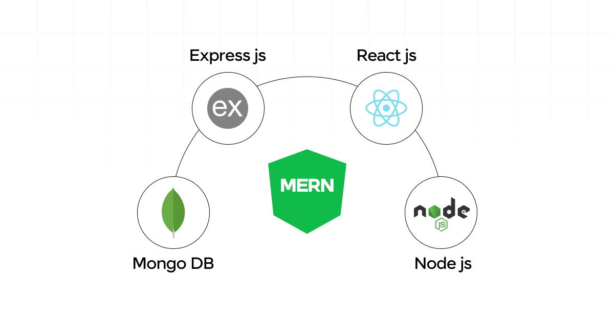

# Survey Buddy

## build-partA

### Description

This survey app is designed to make creating and managing surveys effortless. Whether you’re a student collecting data for a project, an individual seeking personal insights, or a business gathering customer feedback, this app provides a simple and intuitive experience for all users.

With just a few clicks, you can design a custom survey tailored to your needs, select recipients from your network, and send it out instantly. The app ensures that managing responses is just as straightforward. Once the survey is completed, the collected data is displayed in an organised and easy-to-understand format, allowing you to gain valuable insights without hassle.

Built with a focus on simplicity and functionality, this app streamlines the process of creating, distributing, and analysing surveys, making it the perfect tool for anyone looking to gather meaningful information quickly and efficiently.

#### Purpose

The purpose of this app is to provide a straightforward and affordable alternative to complicated and feature-heavy survey platforms. Many existing options overwhelm users with unnecessary features and costs. This app focuses on simplicity, ensuring users can quickly create, share, and analyse surveys without distractions or hidden expenses. It's perfect for those who value ease of use and clarity over complexity.

---

### Functionality / Features

A Mind Map was used to document potential functionality and features.

- User Authorisation:

- User Authentication:

- Create a New Survey:

- Survey Recipients:

- Data Collection:

- Data Display:

### Survey Submission options

1. Make API call to store question data after each answered question:

**_Strengths:_**

- Progress Saving
- Real-Time Analytics
- Adaptive Surveys
  - Questions change based on answers

**_Weaknesses:_**

- Increased API Calls
- Increased Backend Complexity
- User Experience
  - Delays between questions

2. Make one API call to store all data at the end of the survey:

**_Strengths:!_**

- Reduced API Calls
- Easier Backend Management
- User Experience

**_Weaknesses:_**

- Data Loss
  - If a user were to abandon the survey without submission, or their survey expires, their responses will be lost.
- No Real-Time Updates

---

### Target Audience

##### Students:

- Ideal for conducting surveys for academic research, gathering peer feedback, or collecting data for projects, assignments, and theses.
- Useful for group work, where students can collaborate on surveys and analyze responses together.

##### Individuals:

- Perfect for personal insights, self-reflection, and hobby-related topics like fitness tracking, lifestyle choices, or creative writing polls.
- Enables individuals to run informal surveys for friends, social media followers, or community groups.

##### Businesses:

- Customer Feedback: Collect insights on customer satisfaction, product preferences, and overall experience.
- Employee Engagement: Run surveys to measure job satisfaction, gather suggestions, and understand team morale.
- Market Research: Conduct surveys to gather insights on market trends, product demand, and consumer behavior.
- Event Planning: Create RSVP forms or post-event feedback surveys to improve future events.

##### Educators and Trainers:

- Useful for creating quizzes, feedback forms, and evaluations for classes or workshops.
- Allows for tracking and analyzing student or trainee progress over time.
  Nonprofits and Community Groups:

- Ideal for collecting input from members, running community feedback polls, or gathering opinions on local issues.
- Enables organizations to track the impact of their initiatives and programs.
  Healthcare Professionals:

- Use for patient satisfaction surveys, pre-appointment checklists, or anonymous feedback on care quality.

##### Freelancers and Creators:

- Collect feedback on services, products, or creative content like art, music, or writing.
- Use as a tool to engage audiences and build community trust through polls or feedback forms.

##### Small and Large Teams:

- Track project progress and gather feedback from team members in real-time.
- Use surveys for retrospectives, brainstorming sessions, or decision-making.

---

#### Tech Stack

The MERN technology stack was used to build this application:

- MongoDB
- React
- NodeJS
- Express

Other technologies include:

- TypeScript
  
  
- Boostrap
  
- Chakra
- Mongoose
- Amazon S3

---

### Dataflow Diagram

---

### Application Architecture Diagram

---

### User Stories

To enlarge user story diagram's please click on image.

##### 1. Sam's User Story

##### 2. Daisy's User Story

---

### Wireframes

#### Home Page

#### User Survey

---

### Project Management Tracking

##### 13th Nov

The journey begins!

Populated the Trello board with initial Part A tasks. Researched app ideas and extra technology.

##### 14th Nov

Decided on final app idea - Survey Application - started on wireframes, user stories, mind map and mood board.

Continued with competitor research and learning extra tech - typescript.

---
