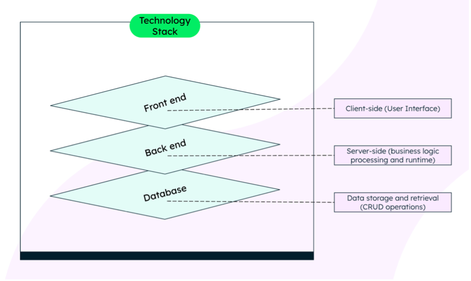
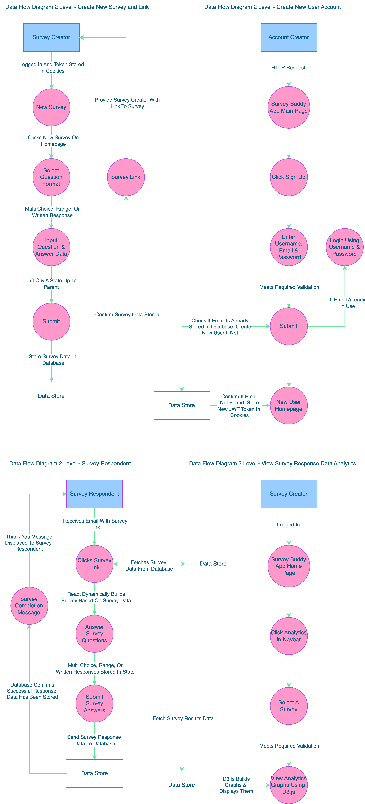
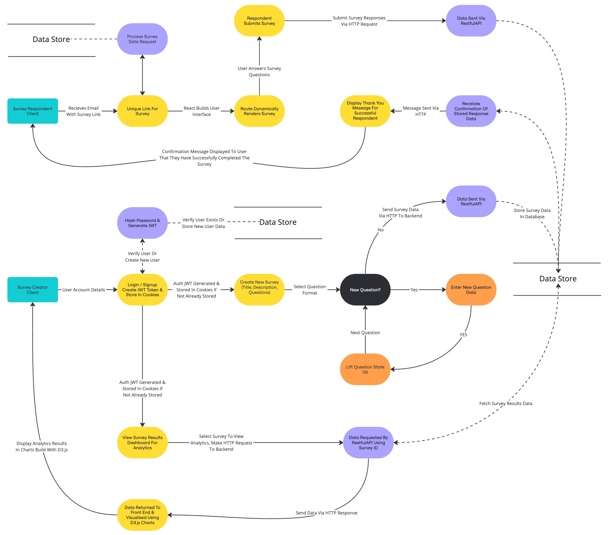
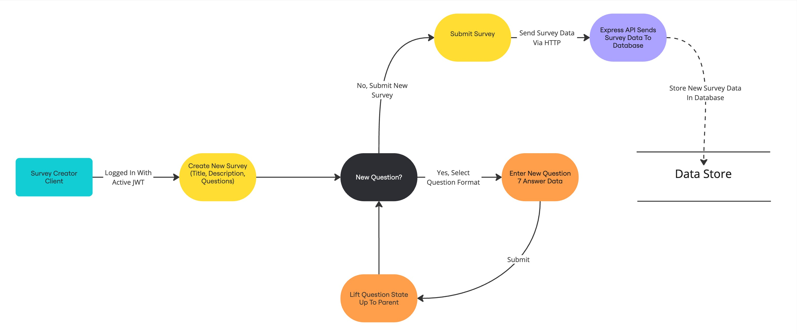
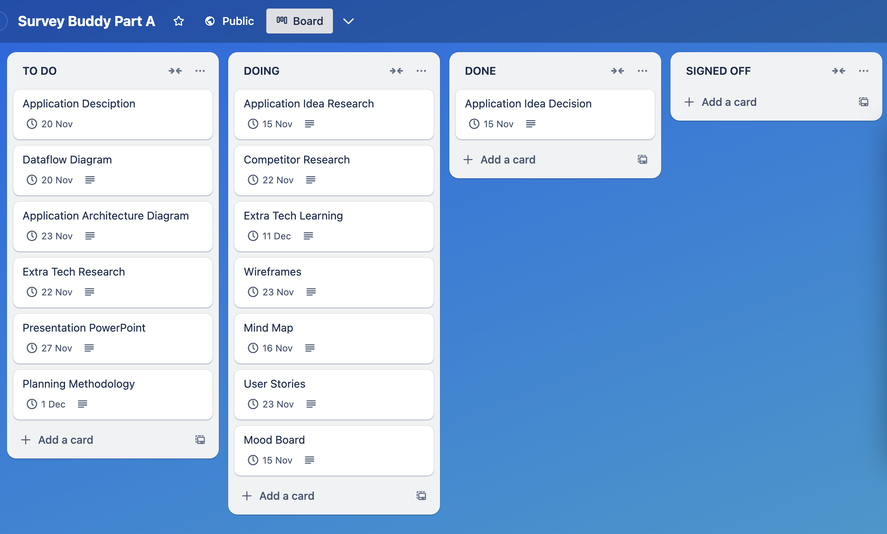
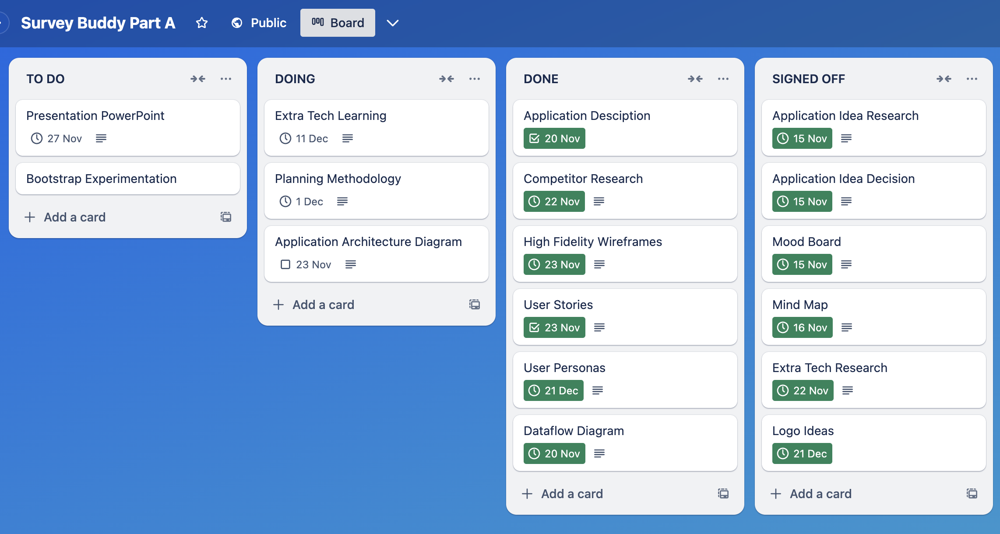

# Survey Buddy

## Part A

#### Front-End Repositiory [here](https://github.com/Survey-Buddy/surveybuddy-client).

#### Back-end Repository here.

#### Presentation here.

#### Project Management Trello Board [here](https://trello.com/b/5D0KTU38/survey-buddy-part-a).

---

## Table of Contents

- [Description](#application-description)
- [Purpose](#application-purpose)
- [Target Audience](#target-audience)
- [Tech Stack](#technology-stack)
- [Features & Functionality](#functionality--features)
- [Logo Idea Exploration](#logo-idea-exploration)
- [Data Flow Diagrams](#data-flow-diagram)
- [Application Architecture Diagram](#application-architecture-diagram)
- [User Stories](#user-stories)
- [Wireframes](#high-fidelity-wireframes)
- [Project Management](#project-management)
- [Trello Board Tracking](#trello-board-tracking)
- [Reference List](#reference-list)

---

### Application Description

This survey app is designed to make creating and managing surveys effortless. Whether you’re a student collecting data for a project, an individual seeking personal insights, or a business gathering customer feedback, this app provides a simple and intuitive experience for all users.

With just a few clicks, you can design a custom survey tailored to your needs, select recipients from your network, and send it out instantly. The app ensures that managing responses is just as straightforward. Once the survey is completed, the collected data is displayed in an organised and easy-to-understand format, allowing you to gain valuable insights without hassle.

Built with a focus on simplicity and functionality, this app streamlines the process of creating, distributing, and analysing surveys, making it the perfect tool for anyone looking to gather meaningful information quickly and efficiently.

---

### Application Purpose

The purpose of this app is to provide a straightforward and affordable alternative to complicated and feature-heavy survey platforms. Many existing options overwhelm users with unnecessary features and costs. This app focuses on simplicity, ensuring users can quickly create, share, and analyse surveys without distractions or hidden expenses. It's perfect for those who value ease of use and clarity over complexity.

---

### Target Audience

##### Students:

- Ideal for conducting surveys for academic research, gathering peer feedback, or collecting data for projects, and assignments.
- Useful for group work, where students can collaborate on surveys and analyse responses together.

##### Individuals:

- Enables individuals to run informal surveys for friends, social media followers, or community groups.

##### Businesses:

- Customer Feedback: Collect insights on customer satisfaction, product preferences, and overall experience.
- Employee Engagement: Run surveys to measure job satisfaction, gather suggestions, and understand team morale.
- Market Research: Conduct surveys to gather insights on market trends, product demand, and consumer behavior.
- Event Planning: Create RSVP forms or post-event feedback surveys to improve future events.

##### Educators and Trainers:

- Useful for creating quizzes, feedback forms, and evaluations for classes or workshops.
- Allows for tracking and analysing student or trainee progress over time.

##### Nonprofits and Community Groups:

- Ideal for collecting input from members, running community feedback polls, or gathering opinions on local issues.
- Enables organisations to track the impact of their initiatives and programs.

##### Healthcare Professionals:

- Use for patient satisfaction surveys, pre-appointment checklists, or anonymous feedback on care quality.

##### Freelancers and Creators:

- Collect feedback on services, products, or creative content like art, music, or writing.
- Use as a tool to engage audiences and build community trust through polls or feedback forms.

##### Small and Large Teams:

- Track project progress and gather feedback from team members in real-time.
- Use surveys for retrospectives, brainstorming sessions, or decision-making.

---

### Technology Stack

The MERN technology stack was used to build this application.

MongoDB explains a tech stack as…

_‘Tech stacks are sets of technologies that are stacked together to build any application.’_

Since no one software alone allows for the ideal full development of an application, multiple technologies are stacked together to facilitate the building of web applications that are easier to maintain and are scalable _(What Is A Technology Stack? Tech Stacks Explained n.d.)_.

A popular modern tech stacks used throughout industry is the MERN stack, it uses JavaScript for the front end and server-side technologies, accompanied by MongoDB, a non-relational database management system to perform CRUD operations. These tech stacks use technologies that are JavaScript focused and are known to work well together, they enable a streamlined and unified development process because the technologies are frameworks and libraries of a single language, that allows for code reusability (MongoDB n.d.).

The acronym for these stacks is:

**M** – MongoDB for the database  
**E** – Express JS for the API server  
**R** – React for the User Interface  
**N** – Node JS for the runtime server environment  

Here is a visual guide of the MERN stack, that displays the overall structure for an app developed using this stack and which technologies interact with each other. The front-end and database operate independently, interacting only with the server-side Express JS and Node JS API environment.

#### Other main technologies include:

- **TypeScript**

  

  _"TypeScript is a strongly typed programming language that builds on JavaScript, giving you better tooling at any scale."_ - typescript.com

- **Boostrap**

  

  _"Powerful, extensible, and feature-packed frontend toolkit. Build and customize with Sass, utilize prebuilt grid system and components, and bring projects to life with powerful JavaScript plugins."_ - bootstrap.com

- **Chakra UI**

  

_"Accessible React components for building high-quality web apps and design systems."_ - chakra-ui.com

- **Mongoose**

  

_"Mongoose is an ODM (Object Data Modeling) library for MongoDB."_ - mongodb.com

- **Amazon S3**

  

_"Amazon Simple Storage Service (Amazon S3) is an object storage service offering industry-leading scalability, data availability, security, and performance."_ - aws.amazon.com/s3

For a complete list of technologies, please refer to **application architecture**.

---

### Functionality / Features

A Mind Map was created to explore and document potential application functionality and features.

### Minimum Viable Product Features

**User Authorisation:** Ensures that only survey creators can access and manage their own surveys and data, stopping unauthorised access.

**User Authentication:** Verifies user identities through secure login, ensuring only registered users can access their accounts.

**Create a New Survey:** Allows users to design and customise surveys by adding questions, choosing formats, and setting preferences.

**Survey Links:** Automatically generates unique links for each survey, making it easy to share with others for responses.

**Survey Analytics:** Provides survey creators with clear visual insights and summaries of survey results, using charts and graphs.

**Data Display:** Displays survey results in a user-friendly layout, showing individual responses and aggregated data where applicable.

### Stretch Goal Features

**Written Summaries:** Generate detailed written summaries of survey results for easy interpretation.

**Large Language Model Response Summary:** Utilise a large language model (e.g., OpenAI API) to create advanced, natural-language summaries of survey data.

**Targeted Survey:** Allow creators to tailor surveys for specific audiences based on criteria like demographics or behavior.

**Authorisation:** Ensure only authorised respondents can access surveys via unique links to maintain privacy and data integrity.

**Rewards:** Introduce a rewards system for respondents, such as redeemable points or gift cards, to incentivise participation.

**Images:** Add carousel-style image questions to support visual responses and enhance survey engagement.

**Amazon S3 Storage:** Use Amazon S3 to securely store large files, such as images or multimedia responses, for scalable data management.

**Pricing:** Implement flexible pricing plans to accommodate survey creators with different needs, from free basic plans to premium features.

**Interactive Questions:** Add drag-and-drop question types to create a more engaging and user-friendly survey experience.

**Question Translation:** Provide automatic question translations to reach a wider audience and support multilingual respondents.

**Auto Reminder Emails:** Send automated reminders to respondents who haven’t completed the survey to boost response rates.

**QR Code Survey Links:** Generate QR codes for surveys, making it easier for users to share and access surveys via mobile devices.

#### Mood Board

To analyse competitor applications and gain a deeper understanding of their features and user interfaces, I created a Mood Board showcasing aesthetics and layouts that resonated with me.

---

### Crucial Decisions

### Survey Submission options

1. Make API call to store question data after each answered question:

**_Strengths:_**

- Progress Saving
- Real-Time Analytics
- Adaptive Surveys
  - Questions change based on answers

**_Weaknesses:_**

- Increased API Calls
- Increased Backend Complexity
- User Experience
  - Delays between questions

2. Make one API call to store all data at the end of the survey:

**_Strengths:_**

- Reduced API Calls
- Easier Backend Management
- User Experience

**_Weaknesses:_**

- Data Loss
  - If a user were to abandon the survey without submission, or their survey expires, their responses will be lost.
- No Real-Time Updates

### TypeScript

After discovering how TypeScript's interface feature can strengthen understanding when building React components, I decided to deepen my understanding of TypeScript's React functionality to incorporate it into my application. This required additional learning, which I supported by completing an online 'Coding With Mosh' course.

---

### Logo Idea Exploration

1.

2.

3.

4.

---

### Data Flow Diagram

#### Data Flow Diagram Methods & Symbols

\*For the following diagrams, the **Yourdon + De Marco** diagram convention will be strictly followed, clearly depicting where data is coming from, where it is going, and how it is being stored.

_geeksforgeeks.org_

There are three levels of Data Dlow Diagrams (DFDs), these inlclude:

- Level-0
- Level-1
- Level-2

#### GeeksForGeeks describe 0-level as:

_"... also known as a context diagram. It’s designed to be an abstraction view, showing the system as a single process with its relationship to external entities."_

#### GeeksForGeeks describe 1-level as:

_"This level provides a more detailed view of the system by breaking down the major processes identified in the level 0 DFD into sub-processes. Each sub-process is depicted as a separate process on the level 1 DFD."_

#### GeeksForGeeks describe 2-level as:

_"This level provides an even more detailed view of the system by breaking down the sub-processes identified in the level 1 DFD into further sub-processes."_

\*It is important to note that JSON Web Tokens (JWTs) are generated in the Express backend, not fetched from the database. The database validates the user's credentials, after which the backend generates and issues the active token. While the data flow diagrams below depict the JWT in the path from the data store to the process, it is actually created within the backend itself.

0-Level Overview of the Survey App:

- _External entities:_

  - Survey Creators: Submit survey details to create surveys.
  - Survey Respondents: Provide responses by filling out surveys.

- _Central system:_

  - Survey Application System processes all user requests.

- _Data flows:_

  - Survey Creators → Submit survey details → Survey Application System.
  - Survey Respondents → Submit survey responses → Survey Application System.
  - Survey Application System → Fetch survey data and results → Survey Creators.

- _Data storage:_

  - All survey data (e.g., questions, responses) is securely stored in MongoDB Atlas.

Breakdown of Processes in the Survey Application:

- _Create Survey:_

  - Survey Creator inputs survey details (title, description, questions).
  - Data is sent via RESTful API to the backend.
  - Backend validates and stores the survey in MongoDB Atlas.

- _Distribute Survey:_

  - A unique link (/survey/{surveyId}) is generated and shared with respondents.
  - Link routes users to a dynamically rendered survey page.

- _Submit Responses:_

  - Respondent answers survey questions.
  - Responses are sent via API to the backend for validation and storage.
  - Stored responses are associated with the respective survey in MongoDB Atlas.

- View Results:

  - Survey Creator requests survey analytics.
  - Backend processes stored responses and generates aggregated data.
  - Data is returned to the frontend and visualised using D3.js charts.

## Further Data Flow Diagrams

#### High Level Data Flow Chart Diagram

#### Level 1 Flow Chart Diagram

### Level 2 Flow Chart Diagrams

#### Respondent Survey Retrieval

#### New Survey Creation

---

### Application Architecture Diagram

Server-side architecture refers to the framework that manages the operations and interactions of a web application's backend components. In this model, the server handles the core logic, processes client requests, interacts with databases, and delivers the appropriate responses to the client-side interface. This approach ensures efficient data processing, security, and scalability.

In the context of the **SurveyBuddy** application, the server-side architecture is implemented as follows:

**Backend Framework:** Utilises Express.js to manage server-side logic and handle HTTP requests and responses.

**Database Interaction:** Employs MongoDB Atlas for data storage, with Mongoose serving as the Object Data Modeling (ODM) library to facilitate database operations.

**Authentication:** Implements JSON Web Tokens (JWT) for secure user authentication, ensuring that only authorised users can access specific functionalities.

**API Endpoints:** Defines RESTful API endpoints to enable communication between the frontend and backend, supporting operations such as survey creation, data retrieval, and analytics.

This server-side architecture ensures that your survey application operates efficiently, securely, and is capable of scaling to meet user demands.

\*It is important to note that both JWT generation and database connections rely on secret keys, which are essential for secure token creation and authentication. Without these keys, the app cannot function properly.

#### **Tech Stack Architecture**

This list breaks down the key technologies used in each architectural component of the app.

#### **Frontend**

- **React**: Framework for building the user interface.
- **useContext API**: For managing global state within the app.
- **React Router DOM**: For routing and navigation between pages.
- **React Forms**: For handling survey inputs and user data.
- **D3.js**: For creating interactive charts and visualising survey analytics.
- **Styling Library** (Bootstrap): For designing the user interface.
- **HTTP Requests** (Fetch): For communicating with the backend.

#### **Backend (Express)**

- **Express.js**: Framework for building the server and API.
- **JWT**: For secure token-based authentication.
- **bcrypt**: For hashing and securely storing passwords.
- **dotenv**: For managing environment variables securely.
- **Mongoose**: For interacting with the MongoDB database.
- **Middleware**:
  - **cors**: For handling cross-origin requests.
  - **body-parser**: For parsing incoming request data (built-in for recent Express versions).
- **Node.js**: Runtime environment for executing JavaScript server-side.

#### **Database (MongoDB Atlas)**

- **MongoDB**: Cloud-based database for storing app data.
- **Mongoose**: Object Data Modeling (ODM) library for database communication.
- **Data Validation**: Ensures data integrity using Mongoose schemas.

#### **General Tools**

- **Git**: For version control and source code management.
- **npm**: For package management and dependency handling.
- **Deployment Platforms**: Netlify, and Render for hosting the app.
- **Testing Tools**:
  - **Frontend**: Jest, React Testing Library.
  - **Backend**: Mocha, Chai, Supertest.

#### **Deployment**

The final application frontend will be hosted on [Netlify](https://www.netlify.com/), the backend on [Render](https://render.com/), and the database on [MongoDB Atlas](https://www.mongodb.com/docs/atlas/).

#### MERN Stack Architecture

The frontend and backend communicate using **HTTP request** and response calls, exchanging data in **JSON** (JavaScript Object Notation) format. **Express**, a server framework built on **Node.js**, powers the backend, managing these communications efficiently and securely.

The frontend will utilise reusable **React components** wherever possible to align with **DRY** (Don't Repeat Yourself) coding principles. The backend will be structured into **routes**, **controllers**, and **models**, each focusing on a specific task or concern to maintain clear **separation of responsibilities**.

---

### User Stories

To enlarge user story diagram's please click on image.

#### 1. Sam's User Story

Creating a new survey.

#### 2. Daisy's User Story

Completing an existing survey.

#### 3. Sarah's User Story

Viewing the analytics page.

#### 4. Tim's User Story

Finding a survey link and emailing it to a friend.

#### 5. Alice's User Story

Navigating to the account page and logging out.

#### 6. John's User Story

Signing up to create a new SurveyBuddy account.

### Evidence of Revision and Refinement

---

### High Fidelity Wireframes

\*Without styling

#### NavBar

Interactions:

- Click
  - About - navigates to About page
  - Surveys - navigates to Surveys page
  - Recipients - navigates to Recipients page
  - Analytics - navigates to Analytics page

#### Home Page

Interactions:

- Click
  - New Survey - navigates to create a new survey page

#### Respondent Survey

Interactions:

- Click
  - Submit - Submits survey response data to database
  - Multi Choice - Selects answer to be stored in database on submit

#### Create Survey

Interactions:

- Click
  - Question Type - Select type of question from drop down menu
  - Previous - Returns to previous question input
  - Next - Navigates to next question input
  - Submit - Submit's survey creator data to database

#### Survey Analytics

Interactions:

- Click
  - Image - to enlarge image

#### Survey's Page

Interactions:

- Click
  - Survey - Navigates to analytics page
  - Link - Provides a copiable link to respondent survey

#### User Account

Interactions

- Click
  - Log Out - Logs user out of account

#### About Page

Interactions NA

#### Interactive Wireframe Diagram

The UI for the survey app is designed to be simple and logical, ensuring an intuitive user experience. The wireframes above demonstrate exceptional planning of the project’s flow and structure, showcasing thoughtful space distribution, clear content prioritisation, and seamless navigation. They outline the intended actions, core functions, and relationships between screens, providing a comprehensive blueprint for the app’s development and ensuring a cohesive user journey.

---

### Project Management

### **Project Management Process Evidence**

To manage the development of my survey app, I used a **Trello board** structured with the following columns: **To Do**, **Doing**, **Done**, and **Signed Off**. This workflow aligns with key principles of the **Agile methodology**, ensuring iterative progress and continuous improvement even as a solo developer. Below is a detailed explanation of how my process meets Agile requirements:

#### **1. Sprint Planning**

- Tasks are broken down into manageable and actionable cards within the **To Do** column.
- Each card represents a clear deliverable or functionality, such as implementing survey creation, authentication, or data visualisation analytics.
- Tasks are prioritised based on user needs, technical dependencies, and project goals.

#### **2. Focused Execution**

- I select tasks from the **To Do** column and move them to **Doing**, focusing on one task, or related tasks, at a time to maintain efficiency.
- Each sprint focuses on completing a single card or a set of related cards within a short time frame.

#### **3. Iterative Development**

- Completed tasks are moved to the **Done** column, where they remain for a period of self-imposed review.
- This delay allows me to revisit the task after a couple of days with fresh eyes, ensuring quality and identifying potential improvements.

#### **4. Continuous Improvement**

- After review, tasks are either:
  - Improved and refined based on identified gaps or optimisations.
  - Moved to the **Signed Off** column once they meet the required standards and are considered complete.
- This step mimics the retrospective phase of Agile, focusing on learning and refining my work iteratively.

#### **5. Transparency and Adaptability**

- The Trello board provides a clear and transparent overview of the project’s progress, from planned tasks to completed features.
- If priorities or requirements change, I adapt the task order in the **To Do** column to reflect the new focus areas.

### **Why This Process Meets Agile Requirements**

- **Iterative Development**: Tasks are completed in small, manageable increments (sprints), allowing for continuous progress.
- **Focus on Quality**: The review process ensures tasks are revisited and refined, aligning with Agile’s emphasis on delivering high-quality, functional software.
- **Adaptability**: The Trello board structure allows for easy reprioritisation of tasks as needed.
- **Self-Reflection**: The review period mimics Agile retrospectives, fostering continuous improvement even as a solo developer.

This process ensures that my development workflow remains organised, iterative, and adaptable while following Agile principles in a manner appropriate for solo work.

### Trello Board Tracking

_It is important to note that the **Extra Tech Learning** and **Planning Methodology** cards represent ongoing tasks and are not considered part of sprints. These cards remain in the **Doing** column throughout most of Part A development and planning._

#### 13th Nov

**The journey begins!**

Populated the Trello board with initial Part A tasks. Researched app ideas and extra technology.

#### 14th Nov

Decided on final app idea - Survey Application - started on wireframes, user stories, mind map and mood board.

Continued with competitor research and learning extra tech - typescript.

#### 15th Nov

Completed Mood Board and continued learning TypeScript for React.

#### 17th Nov

Completed competitor research and started on Data Flow Diagrams.

#### 18th Nov

Completed high fidelity wireframes and user stories, created new low fidelity wireframes and user personas trello cards, decided to use D3.js for data visualisation and analytics, and continued with TypeScript for React online course.

#### 19th Nov

After speaking with my lecturer about wireframes, it was decided that basic high fidelity frames without styling would be sufficient, and that low fidelity wireframes would not be required. Therefore, this card was deleted from the project management Trello board.

When creating the data flow diagrams, flow chart symbols were used inplace of data flow diagram convention symbols, the diagrams were recreated using symbols following the Yourdon + De Marco convention in Drawio.

Adding User Persona's to each User Story including a profile picture, bio, goals, motivation, personality and skills sections.

#### 20th Nov

Completed Data Flow Diagrams and Application Architecture cards, reviewed cards in **Done** column, and moved to signed off where appropriate.

#### 21st Nov

Completed the application architecture diagram card and added a tech architecture diagram to it. Reviewed and made minor changes to wire frames, DFD, user personas and user stories cards and moved to **Signed Off**.

**Part A** of the assignment is almost complete, I now plan to focus my attention on learning TypeScript for React and **Part B** of the assignment.

An **Part A Review** card was added to the Trello Board, to be completed by mid next week.

---

### Reference List

---
